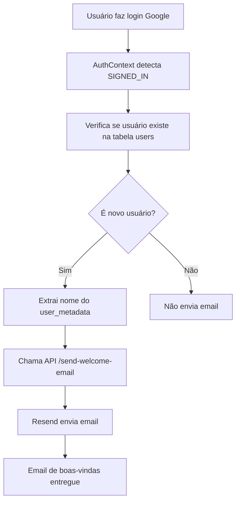

# Configuração do Resend - Emails de Boas-vindas

## 📧 Sobre

O sistema de emails de boas-vindas foi implementado usando o **Resend** para enviar emails automáticos quando um novo usuário se cadastra na aplicação via login do Google.

## 🚀 Configuração

### 1. Criar conta no Resend

1. Acesse [resend.com](https://resend.com)
2. Crie uma conta
3. Configure seu domínio (opcional, mas recomendado para produção)

### 2. Obter API Key

1. No dashboard do Resend, vá em **API Keys**
2. Clique em **Create API Key**
3. Dê um nome para a chave (ex: "XTSkins Production")
4. Copie a chave gerada

### 3. Configurar Variáveis de Ambiente

Adicione as seguintes variáveis no seu arquivo `.env.local`:

```bash
# Resend Email Service
RESEND_API_KEY=re_xxxxxxxxxxxxxxxxx
RESEND_FROM_EMAIL=XTSkins <noreply@seudominio.com>

# App Configuration (opcional)
NEXT_PUBLIC_APP_URL=https://seudominio.com
```

**Importante:** 
- Substitua `re_xxxxxxxxxxxxxxxxx` pela sua API key real
- Substitua `seudominio.com` pelo seu domínio configurado no Resend
- Se não configurar domínio, use: `XTSkins <onboarding@resend.dev>`

### 4. Configurar Domínio (Recomendado para Produção)

1. No dashboard do Resend, vá em **Domains**
2. Clique em **Add Domain**
3. Digite seu domínio (ex: `seudominio.com`)
4. Configure os registros DNS conforme instruções do Resend
5. Aguarde a verificação

## 🎨 Template de Email

O template foi criado com design moderno e responsivo, incluindo:

- **Branding da XTSkins** com emoji de gaming 🎮
- **Mensagem de boas-vindas personalizada** com o nome do usuário
- **Lista de benefícios** com ícones
- **Botão CTA** para começar a usar a aplicação
- **Informações da conta** criada
- **Footer** com informações da empresa

### Personalização

Para personalizar o template, edite o arquivo:
```
components/email-template.tsx
```

## 🔧 Como Funciona

### Detecção de Novos Usuários

1. **Login com Google**: Usuário faz login via Google OAuth
2. **Verificação**: Sistema verifica se é um usuário novo consultando a tabela `users`
3. **Envio**: Se for novo usuário, envia email de boas-vindas automaticamente
4. **Prevenção**: Evita envios duplicados usando referência em memória

### Fluxo Técnico



## 📁 Arquivos Criados/Modificados

### Novos Arquivos
- `components/email-template.tsx` - Template do email
- `app/api/send-welcome-email/route.ts` - API route para envio
- `lib/services/email-service.ts` - Serviço de email
- `docs/RESEND_SETUP.md` - Esta documentação

### Arquivos Modificados
- `context/AuthContext.tsx` - Adicionada detecção de novos usuários
- `package.json` - Adicionada dependência do Resend

## 🧪 Testando

### Teste Local

1. Configure as variáveis de ambiente
2. Faça logout da aplicação
3. Faça login com uma conta Google nova
4. Verifique o console do browser para logs
5. Verifique se o email foi enviado

### Teste da API Diretamente

```bash
curl -X POST http://localhost:3000/api/send-welcome-email \
  -H "Content-Type: application/json" \
  -H "Authorization: Bearer SEU_ACCESS_TOKEN" \
  -d '{
    "firstName": "João",
    "email": "joao@exemplo.com",
    "isNewUser": true
  }'
```

## 🚨 Solução de Problemas

### Email não está sendo enviado

1. **Verifique as variáveis de ambiente:**
   ```bash
   echo $RESEND_API_KEY
   ```

2. **Verifique os logs do console:**
   - Abra DevTools → Console
   - Procure por erros relacionados ao email

3. **Verifique a API:**
   - Teste a rota `/api/send-welcome-email` diretamente
   - Verifique se a autenticação está funcionando

### Erro de autenticação

- Certifique-se que o usuário está logado
- Verifique se o token JWT está sendo enviado corretamente

### Erro de domínio

- Se usar domínio personalizado, verifique se está verificado no Resend
- Use `onboarding@resend.dev` para testes

## 📊 Monitoramento

### Dashboard do Resend

No dashboard do Resend você pode:
- Ver estatísticas de emails enviados
- Verificar bounces e spam
- Monitorar a reputação do domínio

### Logs da Aplicação

Os logs são exibidos no console do Next.js:
```bash
npm run dev
```

Procure por:
- `Email enviado com sucesso:`
- `Erro ao enviar email:`

## 🔐 Segurança

- ✅ API protegida com autenticação JWT
- ✅ Validação de dados de entrada
- ✅ Rate limiting implícito (evita duplicatas)
- ✅ Logs de erro sem expor dados sensíveis

## 📈 Próximos Passos

Possíveis melhorias futuras:

1. **Templates adicionais:**
   - Email de confirmação de compra
   - Email de promoções
   - Newsletter

2. **Métricas:**
   - Taxa de abertura
   - Clicks no CTA
   - Conversões

3. **Personalização:**
   - Templates baseados no tipo de usuário
   - A/B testing de subject lines

4. **Automação:**
   - Sequência de onboarding
   - Re-engagement campaigns 